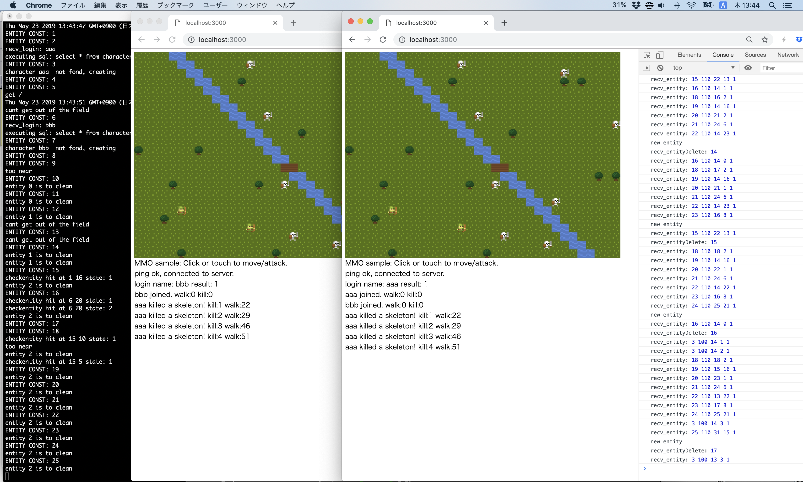

# MMOGサンプルの使い方


あとでMMOサンプルとMOサンプルに分割する予定です。
いまは、全部がbook2/に入っています。


## MMOGサンプルの動作中画面(2人でプレイ中)



画面に10体までのスケルトンがうろついています。プレイヤーは矢印キーまたはW/A/S/Dキーで移動し、
スケルトンを1回押すと、倒すことができます。

## MMOGサンプルに必要なもの

- macOS 10.14
   - Node.js (v11.13.0で確認, npm 6.9.0)
   - MySQL (brew infoで stable 8.0.16)
   

## ゲームサーバー起動前のMySQLの準備(macOS)

1. MySQLサーバーを起動 ```mysql.server start```
2. SQLを発行し、mmosampleデータベースを作成 ```create database mmosample```
3. mmosampleユーザーを作成

```
create user "mmosample"@"localhost" identified with mysql_native_password by "mmosample";
grant all privileges on mmosample.* to 'mmosample'@'localhost';
```

ここでのパスワードはソースコードにハードコードされているので上記と一致している必要があります。

## ゲームサーバー起動

1. git clone book2    
2. cd book2/
3. npm i
4. npm install nodemon
5. nodemon start  # MySQLの接続が重要。エラーがでなかったら接続成功している。
6. ブラウザをひらいて、http://localhost:3000 にアクセス。
7. Login name: というプロンプトで任意の名前を入力。パスワード認証は実装していない
8. プレイ開始


## システム構成

```
MySQL - gmsv(gmsv.js) - cl(index.html,cl.js)
```

## セーブデータの内容

プレイヤーキャラクターの名前、スケルトンを殺した数、歩いた歩数がセーブされます。
MySQLのクライアントを開いて、以下のように内容を確認して下さい。


```
[@mbp2018 book2]$ mysql -ummosample -pmmosample
mysql> select * from characters;
mysql> use mmosample;
mysql> select * from characters;
+------+------------+------------+
| name | kill_count | walk_count |
+------+------------+------------+
| aaaa |         10 |        181 |
| asdf |          0 |         13 |
+------+------------+------------+
1 row in set (0.00 sec)
```

現在はパスワード認証を実装していませんが、同じ名前でログインしたら、
上記のテーブルからキャラクターデータを読み込んで、続きからプレイできます。


## ソース

```
mmodef.js : RPC定義ファイル
mmoproto_cl.js : クライアント用RPCスタブ
mmoproto_sv.js : サーバー用RPCスタブ
gmsv.js : gmsvの本体
cl.js : クライアントの本体
game.js : gmsvのゲーム内容(gmsv.jsが読み込む)
gl-matrix.js : クライアントとサーバーの両方で使う算術ライブラリ
moyai.js : クライアント用の描画ライブラリ
moyai_common.js : クライアントとサーバー共用のユーティリティ
util.js : サーバー用のユーティリティ(gmsv.jsが読み込む)
rpcgen.js : RPCスタブジェネレータ本体
testrpc.js : RPCスタブのテスタ
```

## 初版のMMOサンプルとの違い

初版のMMOサンプルは、
gmsvがフロントエンドサーバで、その後ろに dbsv, logsv, authsv, などさまざまな種類のバックエンドサーバーがあり、
それぞれをTCPで接続していた。
MySQLへの接続はdbsvがlibmysqlclientを用いて行い、gmsvからdbsvはTCP経由でRPCを使って指示をしていた。
しかしこのレポジトリのMMOサンプルでは、dbsvを経由せずに、 gmsvが直接MySQLに接続している。

その理由は、C++用のlibmysqlがプログラムの実行をブロックするのに対し、
Node.jsのmysqlモジュールはプログラムをブロックしない、非同期処理をすることが前提の設計になっているためである。
Node.jsではMySQL以外にも、WebAPIサーバをバックエンドとして用いるときにも非同期の処理を自然に書くことができるようになっていて、
そのためのPromiseなどの機構も非常によく整備されている。
したがってNode.jsを用いる場合は、バックエンドサーバーを作る必要がなく、直接非同期処理をフロントエンドのgmsvに書くことができる。

現在では、Node以外でもC#やGoを使えば、フロントエンドサーバーで同様のことができる。(TODO:詳しく？)

C++でもできるが、コード量がどうしても増えてしまう(TODO:それでもサンプル？)


